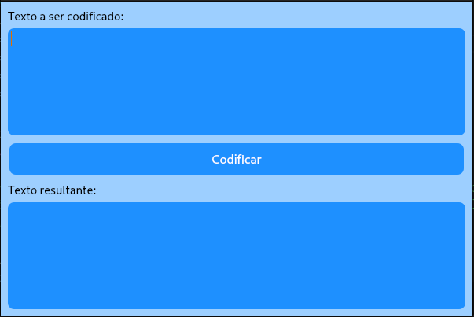

# Código em Python para Codificação de Huffman

Este código Python implementa um algoritmo de codificação de Huffman e cria uma interface gráfica de usuário (GUI) para codificar texto usando a codificação de Huffman.

## Importações

O código começa com algumas importações de bibliotecas necessárias. As importações incluem:

- `sys`: Utilizado para interagir com o sistema e saída padrão.
- `PyQt5`: Uma biblioteca para criar interfaces gráficas de usuário.
- `collections`: Usado para trabalhar com coleções, como dicionários com valores padrão.
- `heapq`: Utilizado para criar uma fila de prioridade (heap).

## Classe `NoHuffman`

A classe `NoHuffman` é definida para representar um nó na árvore de Huffman. Cada nó possui os seguintes atributos:

- `caractere`: O caractere associado ao nó (ou `None` para nós intermediários).
- `frequencia`: A frequência do caractere.
- `esquerda`: Referência ao nó filho esquerdo.
- `direita`: Referência ao nó filho direito.

Além disso, a classe define um método `__lt__` que permite comparar nós com base em suas frequências, o que será útil ao construir a árvore de Huffman.

## Função `construir_arvore_huffman`

Esta função recebe um texto como entrada e constrói a árvore de Huffman correspondente. Ela faz o seguinte:

1. Inicializa um dicionário `frequencias` para rastrear a frequência de cada caractere no texto.
2. Conta a frequência de cada caractere no texto e armazena no dicionário `frequencias`.
3. Cria uma lista `fila_prioridade` de objetos `NoHuffman`, cada um representando um caractere e sua frequência.
4. Usa a função `heapq.heapify` para transformar a lista `fila_prioridade` em uma fila de prioridade (heap).
5. Combina os nós de menor frequência em um novo nó pai até que reste apenas um nó na fila, que representa a raiz da árvore de Huffman.

## Classe `ArvoreHuffman`

A classe `ArvoreHuffman` é criada para gerenciar a árvore de Huffman e a codificação de texto. Ela tem os seguintes métodos:

-`construir_arvore_huffman`: Constrói a árvore de Huffman a partir de um texto de entrada.
-`codificar_texto`: Codifica um texto usando a árvore de Huffman.

## Classe `HuffmanGUI`

A classe `HuffmanGUI` representa a interface gráfica de usuário (GUI) para a codificação de Huffman. Ela usa a biblioteca PyQt5 para criar a janela e elementos da GUI.

## Função `codificar_texto`

Esta função recebe a árvore de Huffman e um texto como entrada e retorna o texto codificado usando a codificação de Huffman. Ela faz o seguinte:

1. Cria um dicionário `codigos` para armazenar os códigos de Huffman de cada caractere na árvore.
2. Define uma função interna `gerar_codigos` que percorre a árvore de Huffman e gera os códigos de Huffman para cada caractere.
3. Chama a função `gerar_codigos` para preencher o dicionário `codigos`.
4. Itera pelo texto original e substitui cada caractere pelo seu código de Huffman.
5. Retorna o texto codificado.

## Classe `HuffmanGUI`

Esta classe representa a interface gráfica de usuário (GUI) para a codificação de Huffman. Ela usa a biblioteca PyQt5 para criar a janela e elementos da GUI.

A GUI inclui:

- Um campo de entrada de texto onde o usuário pode inserir o texto a ser codificado.
- Um botão "Codificar" que inicia o processo de codificação.
- Uma área de exibição do texto codificado.

O método `codificar` é chamado quando o botão "Codificar" é clicado. Ele obtém o texto do campo de entrada, constrói a árvore de Huffman e exibe o texto codificado na área de exibição.

## Execução Principal

O código principal cria uma instância da aplicação PyQt, uma janela `HuffmanGUI`, a exibe e inicia o loop principal da aplicação.

## Estilo da GUI

A GUI é estilizada usando CSS embutido para definir cores de fundo, cores de texto, formato de botão e outros estilos.
